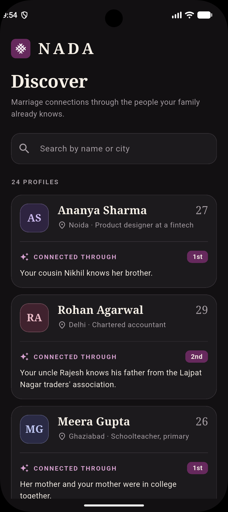
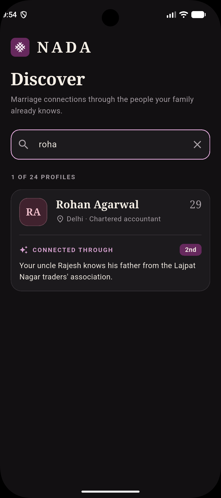
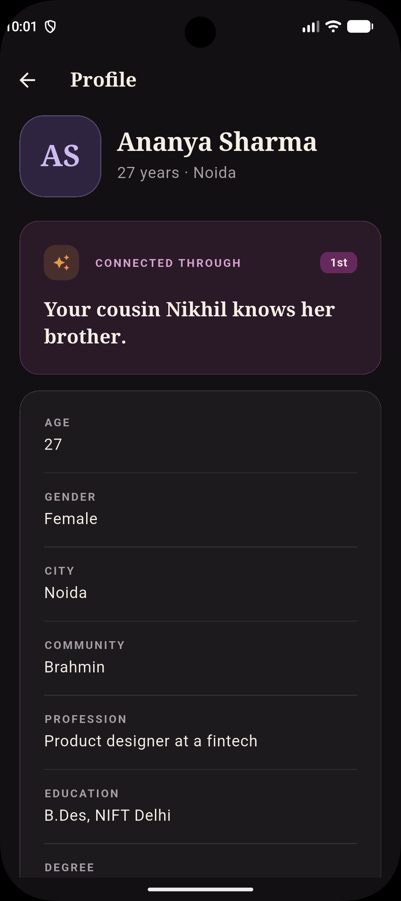
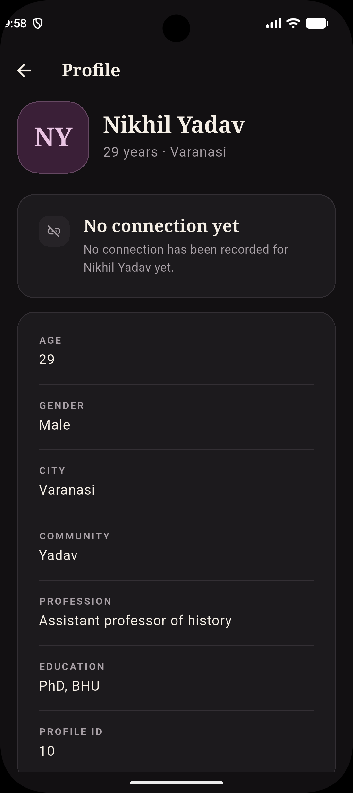
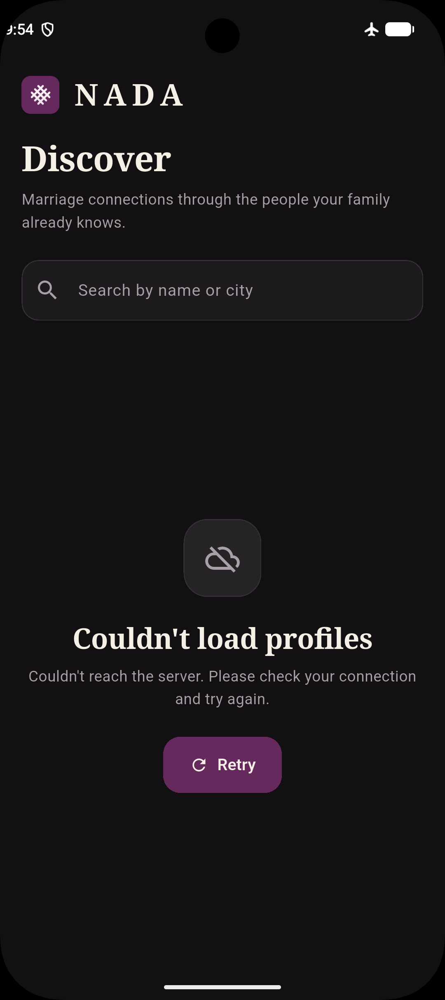

# NADA: Profiles & Connections

A two-screen Flutter app for the NADA Network Flutter intern take-home. It
loads 24 profiles from a remote JSON file, lets you search them, and shows how
each person is connected to you.

## Download APK

**[Download NADA APK (v0.1)](https://github.com/shikhar11x/Nada_Apps/releases/download/V-0.1/app-release.apk)**

Download and install the APK on your Android device to try the app.


## Screenshots

Captured on an Android emulator.

| Discover | Search | Profile details |
|---|---|---|
|  |  |  |

| No connection yet | Error and retry | Splash |
|---|---|---|
|  |  |  |

## Features

- Fetches profiles over HTTPS at runtime (no bundled copy of the data)
- Profile list with name, age, city and the "connected through" line
- Case-insensitive search by name and city, with a clear button
- Loading skeleton, "No profiles match" empty state, and an error state with a
  working Retry button
- Profile details screen with the connection shown prominently
- Handles null and missing fields, a profile with no connection, very long
  text, and Hindi text
- Widget, unit and repository tests that use fakes (no live network)

## Setup

Prerequisites: Flutter (stable, Dart 3.13+) and an Android emulator or iOS
simulator.

```bash
flutter pub get
flutter emulators                      # list available emulators
flutter emulators --launch <emulator_id>
flutter run
```

### Dataset URL

The URL is defined in one place: `lib/core/app_config.dart`
(`AppConfig.profilesUrl`).

To see the error state, start the app offline (airplane mode) or temporarily
change that URL to an invalid one, then restore it and tap Retry.

## Tests

```bash
flutter test                                        # everything
flutter test test/profile_list_screen_test.dart     # search, empty, retry, navigation
```

Tests use a fake `ProfileRepository` through Riverpod provider overrides, so
they never touch the network.

## Architecture

```
lib/
  app/                     app shell, theme tokens, wordmark
  core/                    app config, AppException
  features/profiles/
    data/                  Profile model, repository (one HTTP call)
    application/           Riverpod providers (fetch, search query, filtered list)
    presentation/          screens, widgets, display formatters
```

- State lives in Riverpod providers. The list is fetched once; the search query
  is a separate provider and the filtered list is derived from both, so typing
  never triggers a network request.
- Retry calls `ref.invalidate(profilesProvider)`, which performs a real refetch.
  Automatic retries are turned off so errors show immediately.
- `Profile.fromJson` treats null, missing and blank values as absent, and keeps
  the original JSON in `raw` so no field is lost.
- Widgets only render. Formatting rules live in `profile_formatters.dart`.

## Assumptions

- The dataset does not define `degree`. It is shown as an ordinal badge
  ("1st", "2nd") next to the connection, and only when it has a value.
- `gender` codes `F` and `M` are shown as "Female" and "Male".
- Missing fields are hidden rather than shown as placeholders.

## Known limitations

- Tested on: <your emulator, e.g. Pixel 7, Android 14>. Not tested on iOS.
- No profile photos (not in the data), so avatars are initials.
- Heading font is the platform serif, not a bundled brand font.
- The logo and app icon were supplied by me and are not an official asset kit.

## What I would do next

- Pull-to-refresh and caching so the list works offline
- Filters (city, community) and sorting
- Integration test that runs against a local mock server
- Golden tests for the cards and details screen
- Proper accessibility audit with TalkBack
- Bundle a brand serif font and support light theme

## AI tools used

- **Claude (Anthropic)** helped plan the architecture and UI direction, wrote a
  first draft of much of the code and tests, and drafted this README. I ran,
  reviewed and edited the code, and I can explain every part of it.
<edit this section so it matches what you actually did>
